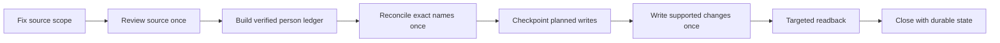

# From Poor-Quality Images to a Governed Data System

*How a human-directed AI workflow evolved from basic extraction into a persistent, resumable, evidence-controlled operating system.*

> **The interesting part was never the spreadsheet. It was the operating system that had to emerge between the human and the AI before the spreadsheet could be trusted.**

## What This Repository Documents

The source material was a large archive of digital photographs of computer screens from a legacy business system. The goal was to recover every readable human name, retain only information that could be reliably associated with that person, avoid unsupported inference, deduplicate conservatively, and produce one structured workbook that could be trusted.

The project completed with

- **23,342 final person records**
- **Batch 215** as the final recorded closure point
- **ChatGPT Chat** as the execution environment through completion
- **one canonical workbook** containing structured records plus durable summary, exception, and execution-state surfaces

The deeper experiment was whether ordinary conversational AI could be hardened into a controlled execution environment without adding a heavier orchestration layer unless the evidence required it.

## Why The Workflow Had To Evolve

The initial task looked like visual extraction. Real execution exposed several different failure classes.

Source files repeated prior evidence. Rows were clipped or obstructed. The same person could appear repeatedly. Different people could share the same name. Threads could stop during execution. Writes could become uncertain after interruption. Conversation history could not reliably preserve the exact state needed for safe continuation.

Each meaningful failure changed the architecture.

The workflow eventually introduced

- source governance before record governance
- direct visual evidence as the final authority for spelling and association
- exact-name-only deduplication with minimal normalization
- explicit ambiguity preservation instead of guessed identity resolution
- one canonical mutable master
- durable execution state outside conversation history
- checkpointed reconciliation before mutation
- read-before-replay recovery for uncertain writes
- targeted readback after each supported write
- continuity gates that distinguished fresh recovery from uninterrupted execution
- simplified one-check reconciliation once evidence thresholds had been met

The result was not a more complicated executor. It was a smarter operating system around the executor.

## The Architectural Shift

The mature workflow reduced improvisation by moving recurring judgment into explicit rules, state, recovery logic, and evidence standards.

See [Mature Batch Workflow](architecture/mature-batch-workflow.md) and [Interruption Recovery Model](architecture/interruption-recovery-model.md) for the operating architecture.

## The Integrity Event That Changed The Architecture

One late-stage source scope had already been summarized through aggregate controls. A later direct source-grounded reconstruction produced materially different results.

| Measure | Earlier aggregate control | Source-grounded reconstruction |
| --- | ---: | ---: |
| Unique readable people | 220 | 376 |
| Zero exact-name matches | 15 | 59 |
| Single exact-name matches | 179 | 278 |
| Multiple exact-name ambiguities | 26 | 39 |

The earlier result was not forced onto the source.

> **The historical result became variance evidence, not a target.**

The source boundary was locked, the scope was rebuilt at the row level, and verified source evidence superseded the earlier aggregate answer.

See [Integrity Reconstruction](artifacts/integrity-reconstruction.md).

## The Instructions Became An Operating Contract

The project instructions were rewritten repeatedly as live execution exposed missing controls. Source eligibility, identity rules, enrichment, continuity, mutation, recovery, readback, exception handling, and closure logic progressively moved into explicit operating rules.

One attempted compression weakened important recovery protections and was rejected after audit.

> **At that point, the prompt was no longer a request. It had become a tested operating contract.**

The public repository shows the evolution of those controls without publishing the complete internal execution prompt.

See [Control Evolution](artifacts/control-evolution.md).

## The Model Lesson

For much of the project, the intuitive assumption was that a complex project should benefit from the most complex reasoning configuration.

Late in the project, after more decision logic had been encoded into the operating architecture, the workflow was moved to an Instant configuration. One mature batch then completed cleanly in approximately 11 minutes.

That is an observation, not proof that Instant is generally better or that model configuration alone caused the result.

The more defensible hypothesis is that the nature of the work had changed. Higher reasoning had helped diagnose and design the system. Better system design then reduced how much open-ended reasoning the executor needed during routine operation.

See [Model Configuration Experiment](artifacts/model-configuration-experiment.md).

## Human-Directed Orchestration

The human role did not disappear as the workflow became more autonomous.

It moved up a level.

The human set evidence thresholds, diagnosed failures, decided when a local error revealed a system flaw, preserved ambiguity when the evidence could not support certainty, decided when work should resume rather than restart, and determined whether another execution environment was justified.

The operating principle that emerged was simple.

> **AI did not remove accountability as the workflow became more autonomous. It moved human judgment up a level.**

## Related Reasoning Systems

[GTM AI Reasoning Systems](https://github.com/sschoenfeld-scotty/gtm-ai-reasoning-systems) is the broader body of work documenting reasoning architectures and their evolution. It also contains evaluation methods and related applied reasoning work.

This case study is a related applied AI operating project. It demonstrates human-directed orchestration and evidence discipline in a persistent AI workflow. It also shows how failures shaped control design and moved human judgment into the operating system around the workflow.

The case remains in its own repository as an applied demonstration of that broader operating philosophy. It is not direct validation of Full Stack v5 or GTM Diagnostic Framework v9. No claim is made that it executed a particular framework version.

## Repository Map

| Area | Purpose |
| --- | --- |
| [Case Study](case-study/from-images-to-governed-data-system.md) | GitHub-native executive narrative |
| [Architecture](architecture/README.md) | Mature workflow and recovery design |
| [Decision History](decision-log/material-inflection-points.md) | Material causal inflection points only |
| [Artifacts](artifacts/README.md) | Sanitized evidence supporting the narrative |
| [Rights and Reuse](RIGHTS.md) | Public reuse boundary |

## Evidence And Limits

This repository distinguishes documented outcomes from broader hypotheses.

The reported project outcomes are grounded in retained private project records, including the final recorded project workbook and preserved batch audit evidence. Those production records are not published in this repository.

The public repository documents the operating method and selected evidence. It does not provide an independently reproducible verification package.

The final record count and closure point are documented project outcomes. The late-stage integrity reconstruction is a documented recovery event. The approximately 11-minute Instant execution is one observed batch result, not a benchmark or universal model comparison.

The surviving evidence did not support one clean, project-wide total for the number of source images. No precise image count is claimed here.

## Public Boundary

This repository intentionally excludes production source images, real contact information, raw working spreadsheets, private source links, internal storage identifiers, and the full implementation-level operating instructions.

The purpose is to make the architecture, evidence discipline, failure-driven evolution, and human judgment inspectable without exposing sensitive source data or unnecessary operating IP.

## Current Status

The underlying project is complete. This repository is the public evidence and architecture layer beneath the case study.

The case study tells the story.

This repository shows the operating evolution that made the story real.
