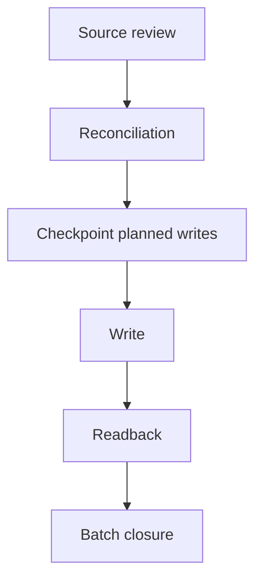
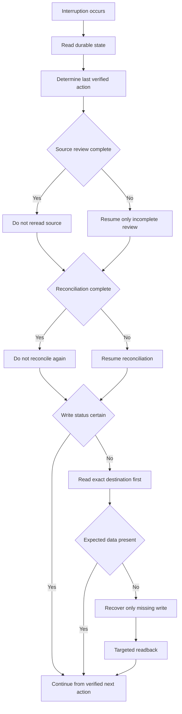

# Interruption Recovery Model

The workflow could not depend on conversation history alone. Long-running execution exposed practical limits that could stop work after source review, after reconciliation, or after an attempted write.

The recovery model therefore treated durable state as the continuity authority.

## Normal Execution Path

## Interruption Path

## Recovery Rules

A checkpoint was valid only when it contained enough reconstructable evidence to continue without reopening all prior source material.

A simple completion marker was not sufficient.

The mature state preserved the information needed to determine

- active batch scope
- processed source
- verified people and supported data
- source issues
- reconciliation results
- planned writes
- exceptions
- next action
- write status

If the source review was already complete, the workflow resumed at reconciliation rather than rereading every image.

If reconciliation and planned writes were already complete, the workflow resumed at mutation rather than repeating reconciliation.

If a write had been attempted but not verified, the system read the exact destination before deciding whether to replay it.

If the expected data was present, the write was not replayed.

If it was absent, only that specific mutation was recovered and then read back.

If continuity could not be established with sufficient confidence, the workflow stopped rather than guessing.

## Continuity Gate

A fresh session or interruption used a full continuity check to confirm the canonical master identity, current record total, latest completed batch state, required workbook surfaces, and expected schema.

Inside one uninterrupted verified execution chain, the prior readback served as the start gate for the next batch. The full gate was not repeated without a specific integrity concern.

This distinction mattered because a control that is repeated after the evidence threshold has already been met can become overhead rather than governance.

## Why This Mattered

The recovery model changed the meaning of continuity.

The project no longer depended on a particular chat thread remembering what happened.

Operational truth lived in reconstructable state.

That made interruption survivable and reduced the risk created by restarting work that had already been verified.
