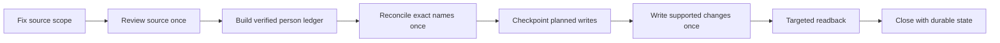

# From Screenshots to a Governed Data System

*How a human-directed AI workflow evolved from visual extraction into a persistent, evidence-controlled operating system.*

## The Problem Looked Simple Until We Tried To Scale It

The source material was a large archive of digital photographs of computer screens from a legacy business system.

The objective sounded straightforward. Capture every readable human name, retain only data that was reliably tied to that person, avoid unsupported inference, deduplicate the resulting records, and create one logical workbook that could be trusted as the canonical result.

The source did not behave like clean data.

Some screens repeated earlier rows. Others were partially clipped, visually obstructed, or captured more than once. The same person could appear repeatedly. Different people could share the same name. Values displayed near a person were not automatically evidence that the values belonged to that person.

That combination turned a basic extraction task into an integrity problem.

The system had to know when to read, when not to infer, when to preserve ambiguity, when to enrich an existing record, and when not to write anything at all.

## The Operating Hypothesis

Execution stayed in ordinary Chat as a controlled test of minimum sufficient orchestration.

The question was not whether a heavier environment could add capability. The question was whether another execution layer was necessary before the existing environment had been fully hardened.

Additional environments remained available as escalation paths. Complexity would be added only when evidence showed that the current environment could not carry the workflow safely or economically.

## Early Proof And Early Warning Signs

The first batches proved that direct visual reading could create useful structured records.

They also exposed the first architectural weakness.

Duplicate source images and files marked as copies were entering normal processing. That meant the same evidence could be reviewed repeatedly and create false confidence, duplicate work, or duplicate trace.

The first major pivot was therefore upstream of extraction.

The source set itself had to become controlled.

Copy-marked files became exclusion evidence only. They could be seen during enumeration so they could be excluded, but they were not opened, processed, counted, reconciled, or traced as valid source evidence.

The first architectural lesson was clear.

> **Data quality could not be solved only at the record level. The source boundary had to become controlled first.**

## The Workflow Kept Breaking Until Chat Became An Operating Environment

As batches became larger, a different class of failures appeared.

A session could stop after source review. Another could stop after reconciliation. A write could be attempted before interruption and remain uncertain. A new thread might not know exactly what had already been verified.

Restarting from the beginning felt safe but introduced new risk. Verified work could be repeated. Reconciliation could be rerun unnecessarily. A mutation could be replayed without knowing whether the original write had already landed.

The project therefore moved continuity out of conversation history and into durable operational state.

A valid checkpoint had to contain enough reconstructable evidence to continue safely. A marker that merely said complete was not accepted as state.

Recovery rules became explicit.

If source review was complete, resume at reconciliation.

If reconciliation and planned changes were complete, resume at the planned write.

If a write had been attempted but not read back, inspect the exact destination first. Replay only if the expected data was absent.

The deeper shift was from conversational continuity to operational continuity.

## The Instructions Became The Operating System

The project instructions were rewritten repeatedly because live failures exposed assumptions that had not been specified strongly enough.

The instructions progressively absorbed source eligibility, identity rules, exact-name deduplication, blank-field enrichment, batch scope, checkpoint requirements, recovery, readback, continuity, exception handling, stop conditions, source chronology, final reconciliation, and export behavior.

One compression attempt is especially revealing.

The instructions had grown large enough that a shorter version was attempted. An audit found that the compressed version had weakened recovery protections and durable trace requirements. Even the reported character count was wrong.

The draft was rejected, corrected, and re-audited before it was allowed to govern execution.

> **At that point, the prompt was no longer a request. It had become a tested operating contract.**

## The Integrity Failure That Changed The Architecture

The most important pivot came late in the project.

One source scope had already been summarized through aggregate controls. A later direct source-grounded recovery produced materially different evidence.

| Measure | Earlier aggregate control | Source-grounded reconstruction |
| --- | ---: | ---: |
| Unique readable people | 220 | 376 |
| Zero exact-name matches | 15 | 59 |
| Single exact-name matches | 179 | 278 |
| Multiple exact-name ambiguities | 26 | 39 |

The easy response would have been to force the source back into the historical numbers.

The system did the opposite.

The source boundary was locked, the scope was rebuilt at the row level, and verified source evidence superseded the earlier aggregate result.

> **The historical result became variance evidence, not a target.**

That incident made a governing principle explicit.

Evidence quality mattered more than preserving a prior answer, even when the prior answer had already been documented.

## The Mature Batch Architecture

The mature workflow became

Deduplication was deliberately conservative.

Names were normalized only for leading or trailing whitespace, repeated spaces, and case-insensitive comparison. No fuzzy matching, spelling correction, nickname resolution, assumed identity, or silent merging was allowed.

A zero exact-name match created one new person.

One exact match allowed only supported enrichment of blank fields.

Multiple exact-name matches created no new row and no enrichment target. The ambiguity remained explicit.

Direct visual evidence remained authoritative for final spelling and field association. Automated text extraction could assist navigation or provisional review, but unsupported or uncertain values did not become canonical data.

## The Model Lesson Surprised Me

For much of the project, the intuitive assumption was that the more complex reasoning configuration should produce the better result because the project itself was complex.

By the end, that assumption had become less useful.

The workflow had already been hardened through repeated break-fix cycles. Decision logic had moved into explicit rules. Continuity had moved into durable state. Mutation risk had moved into checkpointing and readback. Exception behavior had been codified.

The executor needed less improvisation.

With that mature control architecture already in place, one batch completed cleanly in approximately 11 minutes after moving to an Instant configuration.

That observation does not prove that Instant is generally better or that the configuration change alone caused the result.

The narrower hypothesis is more useful.

> **Higher reasoning helped design and pressure-test the system. Better system design reduced the reasoning required to operate it.**

Some intelligence had moved from the executor into the architecture surrounding the executor.

## My Role Became The Orchestration Layer

I was not simply asking AI to extract records.

I was deciding when an output was trustworthy, when a local failure exposed a system flaw, which evidence threshold was sufficient, when ambiguity had to be preserved, when work should resume rather than restart, and when adding another AI environment would create complexity without enough value.

That became the executive operating lesson.

> **AI did not remove accountability as the workflow became more autonomous. It moved human judgment up a level.**

The human role shifted from performing every extraction action to designing the conditions under which the AI was allowed to act.

## What Ultimately Shipped

The final recorded project state contained

- **23,342 person records**
- **Batch 215** as the final recorded closure point
- **ChatGPT Chat** as the execution environment through completion
- **one canonical workbook**
- durable project summary, structured record, exception, and execution-state surfaces
- exact-name governance with supported blank-field enrichment
- verified source exhaustion before final reconciliation
- targeted recovery behavior so interrupted work could continue without blindly replaying completed actions

The final export was replaced only after reconciliation and then fetched back for verification.

The surviving evidence did not support one clean project-wide source-image count. None is claimed here.

## The Takeaway

We often assume that something cannot be valuable unless it is complicated.

This project produced the opposite lesson.

The sophisticated work was not making every execution step more complex. It was absorbing failure-driven complexity into better controls so the next execution could become simpler without weakening the evidence standard.

The goal was not maximum automation or maximum model sophistication.

It was to scale evidence without hiding judgment, then simplify execution without lowering the standard of proof.
